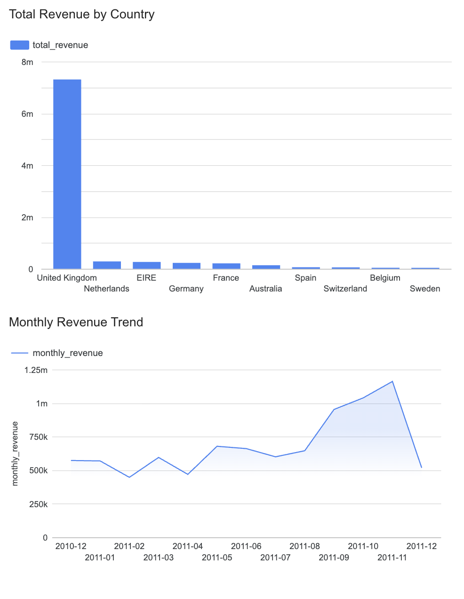

# UK E-Commerce Analytics Pipeline

## Project Description

This project builds an end-to-end batch data pipeline for retail sales analytics using an e-commerce transaction dataset from a UK-based online retailer.

The pipeline starts from raw transaction data, applies data cleaning in Python, stores the cleaned data for downstream use, loads it into Google Cloud, transforms it into analytics-ready tables, and visualizes the results in Looker Studio.

The dashboard answers two main business questions:

1. How does revenue change over time?
2. Which countries contribute the most to total sales?

This project simulates a practical retail reporting workflow where raw transaction records are transformed into structured metrics for reporting and business monitoring.

---

## Dataset

The dataset contains transaction-level e-commerce sales records from a UK-based online retailer.

Main fields used in this project:

- `InvoiceNo`
- `StockCode`
- `Description`
- `Quantity`
- `InvoiceDate`
- `UnitPrice`
- `CustomerID`
- `Country`

---

## Data Cleaning

The raw dataset was cleaned using a Python script before being loaded into the analytics pipeline.

Cleaning steps:

- converted `InvoiceDate` to datetime format
- removed rows with non-positive `Quantity`
- removed rows with non-positive `UnitPrice`
- removed rows with missing `CustomerID`
- excluded cancelled transactions where `InvoiceNo` starts with `C`
- created a new `revenue` column as `Quantity * UnitPrice`

The cleaned dataset is stored at:

`data/processed/cleaned_retail_data.csv`

---

## Pipeline Overview

This project follows a batch pipeline design:

Raw CSV  
→ Python cleaning script  
→ cleaned CSV  
→ Google Cloud Storage  
→ BigQuery  
→ SQL / dbt transformations  
→ Looker Studio dashboard

---

## Project Structure

```bash
.
├── README.md
├── .gitignore
├── dashboard/
│   └── dashboard.png
├── data/
│   ├── raw/
│   │   └── data.csv
│   └── processed/
│       └── cleaned_retail_data.csv
├── scripts/
│   ├── check_data.py
│   └── clean_data.py
├── sql/
│   ├── monthly_revenue.sql
│   └── sales_by_country.sql
├── dbt/
└── terraform/
```
Technologies Used
	•	Python
	•	Pandas
	•	Google Cloud Storage
	•	BigQuery
	•	SQL
	•	dbt
	•	Terraform
	•	Looker Studio

⸻

## Technologies Used

- Python
- Pandas
- Google Cloud Storage
- BigQuery
- SQL
- dbt
- Terraform
- Looker Studio

---

## Analytical Tables

Two main analytical outputs were created for reporting.

### 1. Sales by Country

This table aggregates sales by country and is used for the bar chart showing which countries generate the most revenue.

**Main metrics**
- total orders
- total quantity
- total revenue

**SQL file**  
`sql/sales_by_country.sql`

### 2. Monthly Revenue

This table aggregates monthly revenue by country and is used for trend analysis in the dashboard.

**Main fields**
- invoice_month
- country
- monthly_revenue

**SQL file**  
`sql/monthly_revenue.sql`

---

## Dashboard

The dashboard was built in Looker Studio and includes two main visualizations.

### Total Revenue by Country

Shows which countries contribute the most to total sales.

### Monthly Revenue Trend

Shows how revenue changes over time.

**Dashboard screenshot**  


## How to Run

### 1. Clean the raw dataset

Run the cleaning script:

```bash
python scripts/clean_data.py

```

### 2. Validate the cleaned data

```bash
python scripts/check_data.py
```

### 3. Upload cleaned data to Google Cloud Storage

Upload the cleaned CSV file to the project GCS bucket.

### 4. Load data into BigQuery

Create or load the cleaned dataset into the target BigQuery table.

### 5. Run analytical SQL queries

Run the SQL files in the `sql/` folder to create reporting tables:

- `sql/sales_by_country.sql`
- `sql/monthly_revenue.sql`

### 6. Connect BigQuery tables to Looker Studio

Use the resulting BigQuery tables as data sources for dashboard visualizations.

## Business Value

This pipeline helps transform raw e-commerce transactions into decision-ready reporting assets.

It can support:
	•	revenue monitoring over time
	•	country-level sales comparison
	•	business reporting automation
	•	dashboard-based performance tracking

## Future Improvements

Possible next steps for this project:
	•	add more KPIs such as average order value and customer-level metrics
	•	automate ingestion and loading steps
	•	expand dbt models and tests
	•	add scheduled refresh for reporting tables
	•	build a more interactive dashboard with filters

